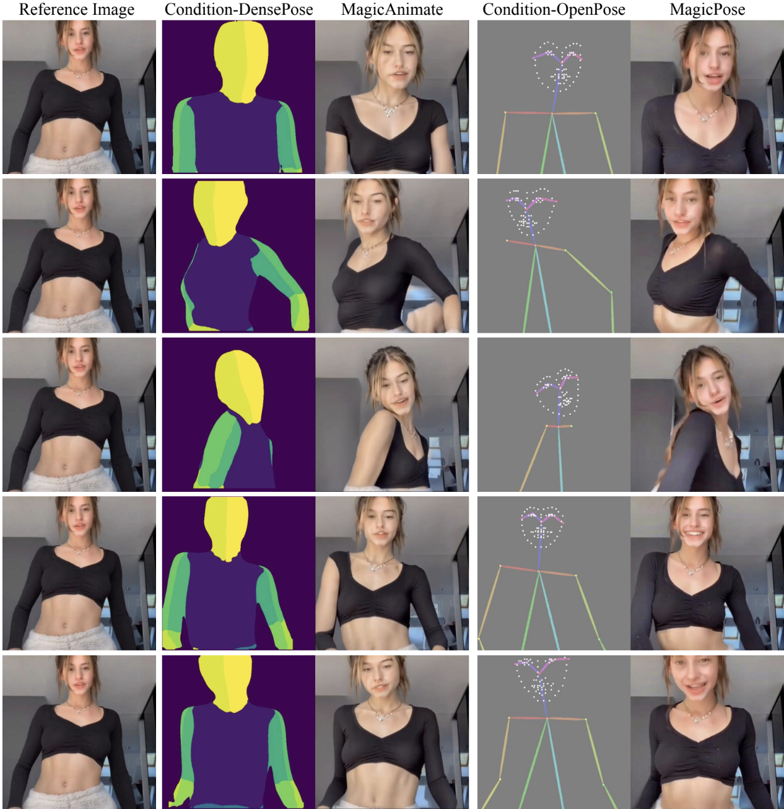
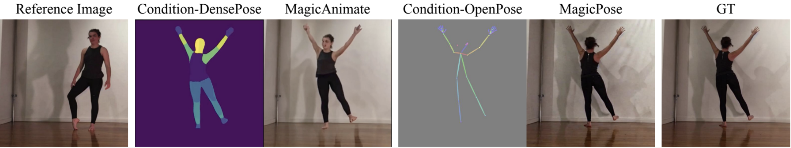
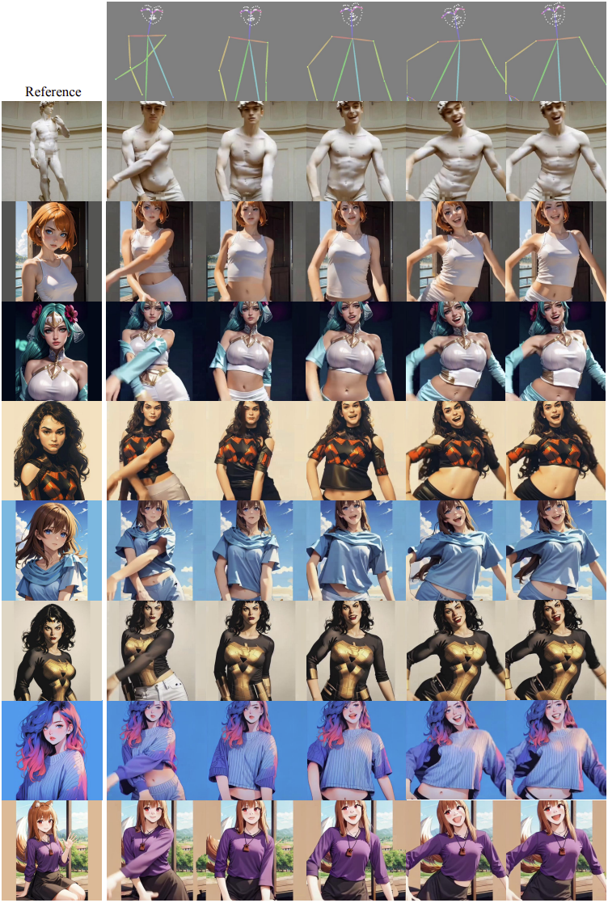
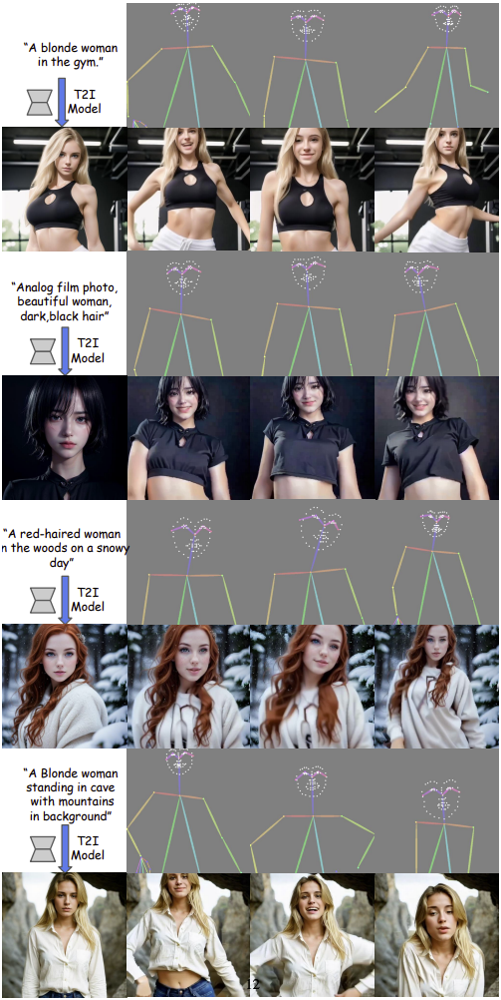
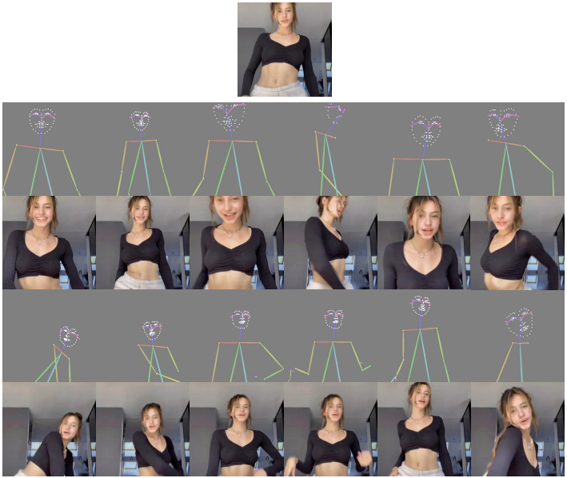

<p align="center">

  <h2 align="center">MagicPose: Realistic Human Poses <br> and Facial Expressions Retargeting with Identity-aware Diffusion</h2>
  <p align="center">
    <a href="https://boese0601.github.io/"><strong>Di Chang</strong></a><sup>1</sup>
    ·  
    <a href="https://seasonsh.github.io/"><strong>Yichun Shi</strong></a><sup>2</sup>
    ·
    <a href="https://zerg-overmind.github.io/"><strong>Quankai Gao</strong></a><sup>1</sup>
    ·
    <a href="https://hongyixu37.github.io/homepage/"><strong>Hongyi Xu</strong></a><sup>2</sup>
    ·
    <a href="https://www.linkedin.com/in/jessica-fu-60a504254/"><strong>Jessica Fu</strong></a><sup>1</sup>
    ·
    <br><a href="https://guoxiansong.github.io/homepage/index.html"><strong>Guoxian Song</strong></a><sup>2</sup>
    ·  
    <a href="https://scholar.google.com/citations?user=0TIYjPAAAAAJ&hl=en"><strong>Qing Yan</strong></a><sup>2</sup>
    ·
    <a href="https://scholar.google.com/citations?user=hPXUR0cAAAAJ&hl=en"><strong>Yizhe Zhu</strong></a><sup>2</sup>
    ·
    <a href="https://scholar.google.com/citations?user=_MAKSLkAAAAJ&hl=en"><strong>Xiao Yang</strong></a><sup>2</sup>
    ·
    <a href="https://www.ihp-lab.org/"><strong>Mohammad Soleymani</strong></a><sup>1</sup>
    ·
    <br>
    <sup>1</sup>University of Southern California &nbsp;&nbsp;&nbsp; <sup>2</sup>ByteDance Inc.
    <br>
    </br>
        <a href="https://arxiv.org/abs/2311.12052">
        
        </a>
        <a href='https://boese0601.github.io/magicdance/'>
        </a>
        <a href='https://youtu.be/VPJe6TyrT-Y'>
        </a>
     </br>
    <table align="center">
        
        
               &nbsp; &nbsp; &nbsp; &nbsp; &nbsp; &nbsp; &nbsp; &nbsp;  GT    &nbsp; &nbsp; &nbsp; &nbsp; &nbsp; &nbsp; &nbsp; &nbsp;  &nbsp; &nbsp; &nbsp; &nbsp; &nbsp; &nbsp; &nbsp; &nbsp;  Pose   &nbsp; &nbsp; &nbsp; &nbsp; &nbsp; &nbsp; &nbsp; &nbsp;  &nbsp; &nbsp; &nbsp; &nbsp; &nbsp; &nbsp; &nbsp; TPS   &nbsp; &nbsp; &nbsp; &nbsp; &nbsp; &nbsp;  &nbsp; &nbsp; &nbsp; &nbsp;  &nbsp; &nbsp; &nbsp; &nbsp; &nbsp; Disco   &nbsp; &nbsp; &nbsp; &nbsp; &nbsp; &nbsp;  &nbsp; &nbsp; &nbsp; &nbsp;  &nbsp; &nbsp; &nbsp; MagicDance
    </table>
</p>

## News
* **[2024.04.03]** Update comparisons to concurrent works. 
* **[2024.02.21]** Update multi-gpu training, dataloader, and instructions for training on your own data. 
* **[2024.02.15]** Release training and inference code. 
* **[2024.02.02]** Release updated paper - MagicPose. The method and data are exactly the same.
* **[2023.11.18]** Release MagicDance paper and project page.


## Related Open-Source Works

* [Disco](https://arxiv.org/abs/2307.00040), from Microsoft
* [MagicAnimate](https://arxiv.org/abs/2311.16498), from ByteDance - Singapore

## Comparison to Concurrent Works
### Comparison to Animate Anyone
<p align="center">
    <table align="center">
        
    </table>
</p>

### Comparison to MagicAnimate
Comparison of MagicPose to MagicAnimate on Facial Expression Editing. MagicAnimate fails to generate diverse facial expressions, while MagicPose is able to.
<div align="center">
  
</div>
<br>

Comparison of MagicPose to MagicAnimate on in-the-wild pose retargeting. MagicAnimate fails to generate the back of the human subject, while MagicPose is able to.


<div align="center">
  
</div>
<br>


## Getting Started 
For inference on TikTok dataset or your own image and poses, download our MagicDance [checkpoint](https://drive.google.com/drive/folders/1Ny5zkgo3aLVekCJTAga-D_XlMGpR1cj2?usp=sharing).

For appearance control pretraining, please download the pretrained model for [StableDiffusion V1.5](https://huggingface.co/Boese0601/MagicDance/blob/main/control_sd15_ini.ckpt).

For appearance-disentangled Pose Control, please download pretrained [Appearance Control Model](https://drive.google.com/file/d/1oGIxynPhluSjs2rycwQdK4sCx2W_81xE/view?usp=sharing) and pretrained [ControlNet OpenPose](https://huggingface.co/Boese0601/MagicDance/blob/main/control_v11p_sd15_openpose.pth).

The pre-processed TikTok dataset can be downloaded from [here](https://drive.google.com/file/d/1jEK0YJ5AfZZuFNqGGqOtUPFx--TIebT9/view?usp=sharing). OpenPose may fail to detect human pose skeletons for some images, so we will filter those failure cases and train our model on clean data.

Place the pretrained weights and dataset as following:
```bash
MagicDance
|----TikTok-v4
|----pretrained_weights
  |----control_v11p_sd15_openpose.pth
  |----control_sd15_ini.ckpt
  |----model_state-110000.th
  |----model_state-10000.th  
|----...
```

## Environment
The environment from my machine is `python==3.9`, `pytorch==1.13.1`, `CUDA==11.7`. You may use other version of these prerequisites according to your local environment.
```bash
conda env create -f environment.yaml
conda activate magicpose
```
### Inference with your own image and pose sequence:
```bash
bash scripts/inference_any_image_pose.sh
```
We offer some images and poses in "example_data", you can easily inference with your own image or pose sequence by replacing the arguments "local_cond_image_path" and "local_pose_path" in inference_any_image_pose.sh. Some interesting outputs from out-of-domain images are shown below:
<div align="center">
  
</div>
Our model is also able to retarget the pose of generated image from T2I model.
<div align="center">
  
</div>


## Inference 
### Inference on the test set:
```bash
bash scripts/inference_tiktok_dataset.sh
```
We use exactly same code from [DisCo](https://github.com/Wangt-CN/DisCo) for metrics evaluation. Some example outputs from our model are shown below:
<div align="center">
  
</div>
<br>


## Training
Appearance Control Pretraining:
```bash
bash scripts/appearance_control_pretraining.sh
```

Appearance-Disentangled Pose Control:
```bash
bash scripts/appearance_disentangle_pose_control.sh
```


### Multi-GPU training:
We have already implemented DistributedDataParallel in the python training script. If you want to use multi gpu instead of the first gpu on your machine for traning, see the following script for an example:
```bash
CUDA_VISIBLE_DEVICES=0,1,2,3,4,5,6,7 torchrun --master_port 10000 --nproc_per_node 8 train_tiktok.py \
```
This will use 8 GPUs and run 8 processes(nproc_per_node=8) for training.

## Using your own video data for training 
For training on your own dataset, you first need to run [openpose](https://github.com/CMU-Perceptual-Computing-Lab/openpose) for your input images/videos and save the visualized pose map. Then, organize them as the format shown in the TikTok dataset. You can also refer to [DisCo-OpenPose Preprocessing](https://github.com/Wangt-CN/DisCo/blob/main/PREPRO.md#openpose) or [ControlNet-OpenPose](https://github.com/lllyasviel/ControlNet-v1-1-nightly?tab=readme-ov-file#controlnet-11-openpose), we use exactly the same Pose ControlNet in our pipeline.
Then set the path to your data in [dataset/tiktok_video_arnold_copy.py](https://github.com/Boese0601/MagicDance/blob/main/dataset/tiktok_video_arnold_copy.py#L287)

```bash
Your Dataset
|----train_set
  |----video_000
    |----000.jpg
    |----001.jpg
    |----002.jpg
    ...
  |----video_001
  |----video_002
  ...
|----pose_map_train_set
  |----video_000
    |----000.jpg
    |----001.jpg
    |----002.jpg
    ...
  |----video_001
  |----video_002
  ...
|----val_set
|----pose_map_val_set
|----test_set
|----pose_map_test_set
|----...
```


## Some tips
### The task
From our experiences with this project, this motion retargeting task is a data-hungry task. Generation result highly depends on the training data, e.g. the quality of pose tracker, the amount of video sequences and frames per video in your training data. You may consider adopt [DensePose](https://arxiv.org/abs/1802.00434) as in [MagicAnimate](https://arxiv.org/abs/2311.16498), [DWPose](https://github.com/IDEA-Research/DWPose) as in [Animate Anyone](https://arxiv.org/pdf/2311.17117.pdf) or any other geometry control for better generation quality. We have tried [MMPose](https://github.com/open-mmlab/mmpose) as well, which produced slightly better pose detection results. Introduce extra training data will yield better performance, consider using any other real-human dataset half-body/full-body dataset, e.g. [TaiChi](https://github.com/AliaksandrSiarohin/first-order-model)/[DeepFashion](https://mmlab.ie.cuhk.edu.hk/projects/DeepFashion.html), for further finetuning.

### The code
Most of the arguments are self-explanatory in the codes. Several key arguments are explained below.

* `model_config` A relative or absolute folder path to the config file of your model architecture.
* `img_bin_limit` The maximum step for randomly selecting source and target image during training. During inference, the value is set to be "all".
* `control_mode` This argument controls the Image-CFG during inference. "controlnet_important" denotes Image-CFG is used and "balance" means not.
* `wonoise` The reference image is fed into the appearance control model without adding noise.
* `with_text` When "with_text" is given, text is **not** used for training. (I know it's a bit confusing, lol)
* `finetune_control` Finetune Appearance Control Model (and Pose ControlNet).
* `output_dir` A relative or absolute folder for writing checkpoints.
* `local_image_dir` A relative or absolute folder  for writing image outputs.
* `image_pretrain_dir` A relative or absolute folder for loading appearance control model checkpoint.
* `pose_pretrain_dir` A relative or absolute path to pose controlnet.

## Citing
If you find our work useful, please consider citing:
```BibTeX
@article{chang2023magicdance,
  title={MagicDance: Realistic Human Dance Video Generation with Motions \& Facial Expressions Transfer},
  author={Chang, Di and Shi, Yichun and Gao, Quankai and Fu, Jessica and Xu, Hongyi and Song, Guoxian and Yan, Qing and Yang, Xiao and Soleymani, Mohammad},
  journal={arXiv preprint arXiv:2311.12052},
  year={2023}
}
```

## License

Our code is distributed under the USC research license. See `LICENSE.txt` file for more information.


## Acknowledgments
This work was sponsored by the Army Research Office and was accomplished under Cooperative Agreement Number W911NF-20-2-0053. The views and conclusions contained in this document are those of the authors and should not be interpreted as representing the official policies, either expressed or implied, of the Army Research Office or the U.S. Government. The U.S. Government is authorized to reproduce and distribute reprints for Government purposes notwithstanding any copyright notation herein.
      
Our code follows several excellent repositories. We appreciate them for making their codes available to the public. We also appreciate the help from [Tan Wang](https://github.com/Wangt-CN), who offered assistance to our baselines comparison experiment.

* [DisCo](https://github.com/Wangt-CN/DisCo)
* [AnimateDiff](https://github.com/guoyww/AnimateDiff)
* [ControlNet](https://github.com/lllyasviel/ControlNet)

