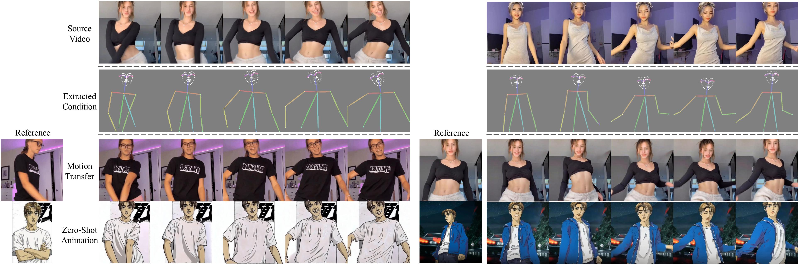

<p align="center">

  <h2 align="center">MagicDance: Realistic Human Dance Video Generation<br>
  with Motions & Facial Expressions Transfer</h2>
  <p align="center">
    <a href=""><strong>Di Chang</strong></a>
    ·  
    <a href=""><strong>Yichun Shi</strong></a>
    ·
    <a href=""><strong>Quankai Gao</strong></a>
    ·
    <a href=""><strong>Jessica Fu</strong></a>
    ·
    <a href=""><strong>Hongyi Xu</strong></a>
    ·
    <br><a href=""><strong>Guoxian Song</strong></a>
    ·  
    <a href=""><strong>Qing Yan</strong></a>
    ·
    <a href=""><strong>Xiao Yang</strong></a>
    ·
    <a href=""><strong>Mohammad Soleymani</strong></a>
    ·
    <br>
    <sup>1</sup>University of Southern California         <sup>2</sup>ByteDance Inc.
    <br>
    </br>
        <a href="">
        
        </a>
        <a href=''>
        </a>
  </p>
  <div align="center">
    
    <!-- </video> -->
  </div>
</p>

*We propose MagicDance, a novel and effective approach to provide realistic human video generation enabling vivid motion and
facial expression transfer, and consistent 2D cartoon-style animation zero-shot generation without any fine-tuning. Thanks to MagicDance,
we can precisely generate appearance-consistent results, while the original T2I model (e.g., Stable Diffusion and ControlNet) can hardly
maintain the subject identity information accurately. Furthermore, our proposed modules can be treated as an extension/plug-in to the
original T2I model without modifying its pre-trained weight.*

<!-- *For avatar-centric video generation and animation, please also check our latest work <a href="">MagicAvatar</a>!* -->

 
## Citing
If you find our work useful, please consider citing:
```BibTeX
@inproceedings{
}
```
